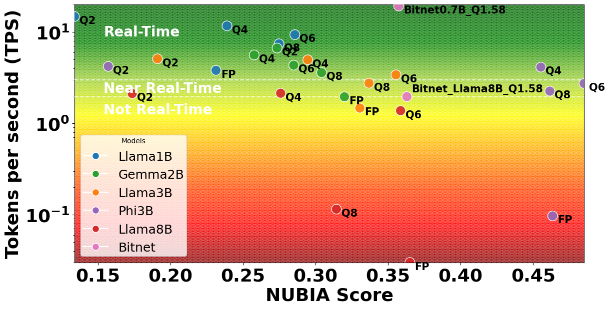

# CVPR-LLMPi

**CVPR-LLMPi** explores the deployment of Large Language Models (LLMs) on edge devices like the Raspberry Pi 5 through efficient post-training quantization techniques (Q2, Q4, Q6, Q8).  
The project focuses on enabling real-time inference while optimizing energy efficiency and maintaining model accuracy.

---

## 📚 Project Overview
- Trade-off analysis between model accuracy, latency, and energy efficiency with quantization for edge AI applications
- Post-training quantization (PTQ) of Large Language Models (LLMs) including Phi-3, Gemma, and Llama-3 across multiple bit-widths (Q2, Q4, Q6, Q8)
- Quantization-Aware Training (QAT) applied to BitNet models (ternary quantization, Q1.58)
- Benchmarking model performance using Tokens per Second (TPS), Tokens per Joule (TPJ), and Words per Battery Life (W/BL)
- Evaluation of quantization impact on semantic coherence using NUBIA scores
- Real-world deployment and energy measurements on Raspberry Pi 5.

---

## 📈 Accuracy vs. Latency Trade-off

This work presents a detailed evaluation of how quantization impacts the trade-off between accuracy and latency in LLM inference on edge devices.
- Models such as **Phi3B** and **BitNet** exhibit strong resilience to quantization, maintaining high NUBIA scores even at lower bit-widths (Q4, Q6).
- **BitNet models** using quantization-aware training (Q1.58) achieve real-time inference speeds with minimal loss in semantic quality.
- Models like **Llama1B**, **Gemma2B**, and **Phi3B** show that PTQ can serve as a viable and efficient alternative to QAT, offering competitive accuracy-latency trade-offs.

---

## 🎯 Objectives
- Enable real-time Large Language Model (LLM) inference on low-power embedded devices
- Reduce energy consumption and improve throughput through post-training quantization (PTQ) and quantization-aware training (QAT)
- Benchmark trade-offs between model precision, latency, and semantic accuracy
- Demonstrate practical deployment of quantized LLMs (Phi-3, Gemma, Llama-3, BitNet) on Raspberry Pi 5
- Evaluate performance using TPS (Tokens Per Second), TPJ (Tokens Per Joule), W/BL (Words Per Battery Life), and NUBIA scores

---

## ⚙️ Requirements
- Python 3.10+
- Llama.cpp
- Raspberry Pi 5 (or compatible ARM64 device)

---

## 📁 Repository Structure
```text
.
├── Code
│   ├── Nubia_Score
│   │   ├── llm_response_bitnet.py
│   │   ├── llm_response.py
│   │   └── nubia.py
│   └── Throughput
│       ├── Throughput_BitNet.py
│       └── Throughput.py
├── Figures
│   ├── Accuracy_over_Latency
│   │   └── nubia.png
│   ├── LLM_Response_Comparison
│   │   └── LLM_Response_Comparison.pdf
│   ├── Nubia_Score
│   ├── TPJ
│   │   └── TPJ.pdf
│   ├── TPS
│   │   └── Final_TPS.pdf
│   └── WPBL
│       └── WPBL.pdf
├── LLM_Responses
│   ├── llm_response_without_whisper_Bitnet_results_CVPR_contextbased
│   │   ├── bitnet_b1_58_large
│   │   │   └── bitnet_b1_58_large.txt
│   │   └── llama3_8B
│   │       └── llama3_8B.txt
│   └── llm_response_without_whisper_results_CVPR_contextbased
│      
└── README.md


